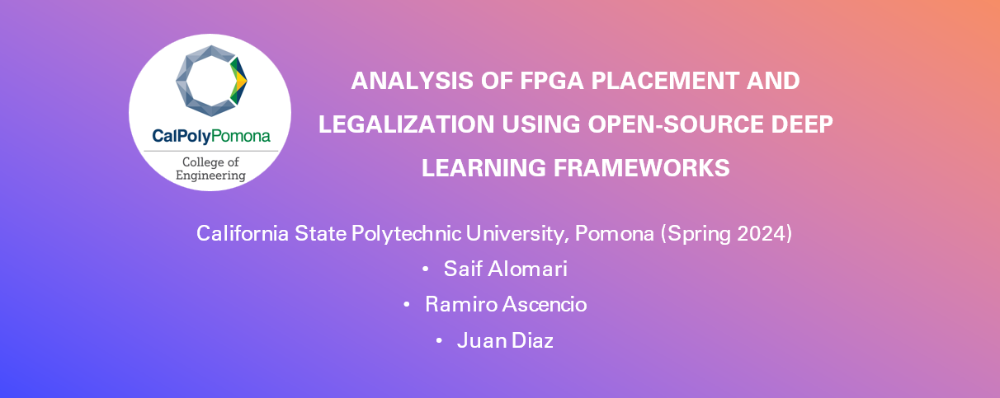

# CPP-ECE-FPGA-PLACEMENT-AND-LEGALIZATION

Research & Senior Design Project Repo for The Analysis of FPGA Placement and Legalization using Open-Source Deep Learning Frameworks.

## Student Contributors
- (1) Saif Alomari
- (2) Ramiro Ascencio
- (3) Juan Diaz

This study examines the design processes of the Deep Learning FPGA placer, DREAMPlaceFPGA, alongside AMD Xilinx's commercial tool, Vivado. It incorporates AMD's open-source routing agent, RapidWright, bridging the gap between open-source and commercial FPGA design tools, facilitating expanded research opportunities outside the limitations of the Vivado IDE. Although this integration shows promising potential, the limited support for additional FPGA devices poses challenges for future scalability. The findings reveal significant reductions in resource utilization, such as LUTs and FFs, and power consumption in most designs. However, these advantages are offset by increased wirelength and consequent delays, likely due to DREAMPlaceFPGA's placements outside the p_block that houses the device's resources. Moreover, the implementation of GPU acceleration markedly improved the efficiency of experiments, reducing processing times from several minutes to mere seconds, highlighting its critical role in enhancing this novel FPGA design methodology.

# Table of Contents
- [CPP-ECE-FPGA-PLACEMENT-AND-LEGALIZATION](#eda-ml)
  - [Table of Contents](#table-of-contents)
  - [About](#About)
  - [DREAMPlaceFPGA Placement Flow and Methodology](#DREAMPlaceFPGA-Placement-Flow-and-Methodology)
  - [Tutorials](#Tutorials)

# About

# DREAMPlaceFPGA Placement Flow and Methodology

# Tutorials
